# SYNC-CODE — Collaborative Cloud IDE

> A production-grade, real-time collaborative IDE that lets multiple developers write, execute, and debug code together in the browser — powered by Yjs CRDTs, Redis, Docker sandboxing, WebRTC, and a Gemini AI pair programmer.

**Live Demo:** [sync-code-express-server.vercel.app](https://sync-code-express-server.vercel.app/)

### Cloud IDE Architecture


### Collaborative Code Editor Architecture


---

## Table of Contents

1. [Overview](#overview)
2. [Feature Set](#feature-set)
3. [Tech Stack](#tech-stack)
4. [System Architecture](#system-architecture)
   - [High-Level Service Topology](#high-level-service-topology)
   - [Monorepo Structure](#monorepo-structure)
5. [Architecture Deep Dives](#architecture-deep-dives)
   - [Dual WebSocket Strategy](#dual-websocket-strategy)
   - [End-to-End Code Execution Pipeline](#end-to-end-code-execution-pipeline)
   - [Redis: Queue + Pub/Sub + Hash](#redis-queue--pubsub--hash)
   - [WebSocket Connection Lifecycle & Room Management](#websocket-connection-lifecycle--room-management)
   - [Message Router](#message-router)
   - [Real-Time Collaboration — Yjs CRDTs](#real-time-collaboration--yjs-crdts)
   - [Docker Sandboxing](#docker-sandboxing)
   - [WebRTC Peer-to-Peer Audio/Video](#webrtc-peer-to-peer-audiovideo)
   - [AI Pair Programmer (Gemini)](#ai-pair-programmer-gemini)
   - [Shared Whiteboard](#shared-whiteboard)
   - [Chat & Image Sharing](#chat--image-sharing)
   - [Session Registration & Routing](#session-registration--routing)
   - [State Synchronization for New Joiners](#state-synchronization-for-new-joiners)
   - [Worker Resilience & Retry Logic](#worker-resilience--retry-logic)
6. [Turborepo & Monorepo Tooling](#turborepo--monorepo-tooling)
7. [Project Structure](#project-structure)
8. [Getting Started](#getting-started)
9. [Environment Variables](#environment-variables)
10. [Deployment](#deployment)
11. [Glossary](#glossary)

---

## Overview

**SYNC-CODE** is a full-stack, cloud-native collaborative IDE that enables multiple developers to write and run code together in real time — directly from the browser. No local setup required.

Code changes propagate instantly across all connected clients using **Yjs Conflict-free Replicated Data Types (CRDTs)**. Code execution happens inside secure, isolated Docker containers. An integrated **Gemini AI** (`gemini-2.5-flash-lite`) pair programmer streams code explanations and bug fixes directly into the shared chat window.

The system is built as a **Turborepo monorepo** with four independently deployable services communicating via HTTP, WebSockets, and Redis.

---

## Feature Set

| Feature | Description |
|---|---|
| **Real-Time Collaborative Editing** | Conflict-free simultaneous editing via Yjs CRDTs and Monaco Editor (VS Code engine) |
| **Multi-Language Code Execution** | Run JavaScript, Python, C++, and Go inside isolated Docker containers |
| **Secure Sandboxing** | Containers run with `--network none`, `--memory="512m"`, `--cpus="0.5"`, and a 20s timeout |
| **WebRTC Video & Audio** | Browser-to-browser peer-to-peer video/audio using a full mesh topology |
| **Shared Whiteboard** | Real-time collaborative canvas with stroke broadcasting and live cursor tracking |
| **AI Pair Programmer** | Google Gemini (`gemini-2.5-flash-lite`) with server-side streaming to all room participants |
| **Persistent Chat** | Markdown-rendered group chat with image sharing support |
| **Reliable Job Queue** | Redis-backed job queue (`lPush`/`brPop`) for ordered, at-least-once code execution |
| **Horizontally Scalable Backend** | Redis Pub/Sub event bus decouples WebSocket servers from workers |
| **Auto-Save with Debouncing** | Debounced auto-save to `localStorage` to prevent UI stuttering |
| **Live Cursor Presence** | Throttled (50ms) cursor position broadcast on the whiteboard |
| **Protected Routes** | `ProtectedRouter` middleware guards the editor from unauthenticated access |

---

## Tech Stack

### Frontend

| Technology | Purpose |
|---|---|
| **React 18** | UI component library |
| **Vite 6** | Dev server and build tool |
| **TypeScript** | Type-safe development |
| **Recoil** | Atom-based global state (`userAtom`, `socketAtom`, `connectedUsersAtom`) |
| **Monaco Editor** (`@monaco-editor/react`) | VS Code editor engine |
| **Yjs + y-monaco + y-websocket** | CRDT engine for conflict-free collaborative text editing |
| **Tailwind CSS v4 + Shadcn/UI** | Utility-first styling with accessible Radix UI primitives |
| **Framer Motion** | UI transitions and animations |
| **react-markdown** | Renders AI responses and chat messages as formatted Markdown |
| **WebRTC (native browser API)** | P2P audio/video — no media server required |
| **react-router-dom v7** | Client-side routing |
| **lodash.throttle / throttle-debounce** | Whiteboard cursor throttling and auto-save debouncing |
| **lucide-react + react-icons** | Icon libraries |
| **sonner** | Toast notifications |

### Backend

| Technology | Purpose |
|---|---|
| **Node.js ≥18** | Runtime for all backend services |
| **Express.js** | REST API for code submission (`POST /submit`) |
| **ws** | Lightweight WebSocket library for the application signaling server |
| **y-websocket** | Dedicated Yjs CRDT sync server (binary protocol) |
| **hyperdyperid** (`str10_36`) | Generates 10-character base-36 room IDs |
| **Redis List** | Job queue — `lPush` by Express, `brPop` by Worker |
| **Redis Pub/Sub** | Event bus — Worker publishes results; WebSocket server subscribes and relays |
| **Redis Hash** | Distributed user-presence store (`room:{roomId}:users`) |
| **@google/generative-ai** | Google Gemini SDK (`gemini-2.5-flash-lite`) for AI code assistance |
| **dotenv** | Environment variable loading |

### Infrastructure & Tooling

| Technology | Purpose |
|---|---|
| **Docker** | Ephemeral, isolated execution environments for user code |
| **AWS ECS** | Container orchestration for Express server and Worker |
| **AWS EC2** | Hosts the stateful WebSocket server |
| **Vercel** | Frontend hosting with global CDN |
| **Turborepo** | Monorepo build system with aggressive caching |
| **npm Workspaces** | Dependency management and cross-package linking |
| **Prettier** | Code formatting across all TypeScript/TSX/Markdown files |

---

## System Architecture

### High-Level Service Topology

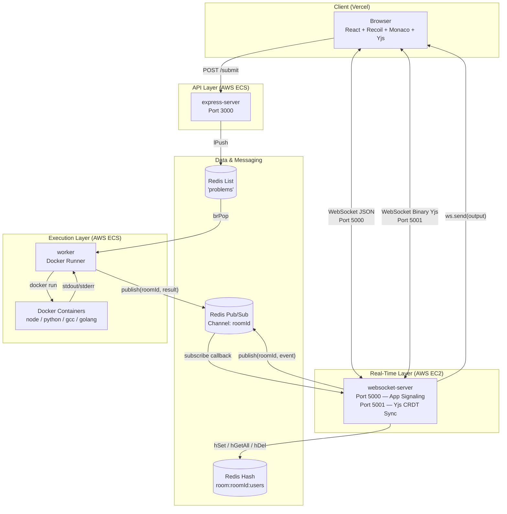
```mermaid
graph TD
    subgraph "Client (Vercel)"
        FE["Browser\nReact + Recoil + Monaco + Yjs"]
    end

    subgraph "API Layer (AWS ECS)"
        EX["express-server\nPort 3000"]
    end

    subgraph "Real-Time Layer (AWS EC2)"
        WS["websocket-server\nPort 5000 — App Signaling\nPort 5001 — Yjs CRDT Sync"]
    end

    subgraph "Data & Messaging"
        RQ[("Redis List\n'problems'")]
        RP[("Redis Pub/Sub\nChannel: roomId")]
        RH[("Redis Hash\nroom:roomId:users")]
    end

    subgraph "Execution Layer (AWS ECS)"
        WK["worker\nDocker Runner"]
        DC["Docker Containers\nnode / python / gcc / golang"]
    end

    FE -- "POST /submit" --> EX
    FE <-- "WebSocket JSON\nPort 5000" --> WS
    FE <-- "WebSocket Binary Yjs\nPort 5001" --> WS
    EX -- "lPush" --> RQ
    RQ -- "brPop" --> WK
    WK -- "docker run" --> DC
    DC -- "stdout/stderr" --> WK
    WK -- "publish(roomId, result)" --> RP
    RP -- "subscribe callback" --> WS
    WS -- "ws.send(output)" --> FE
    WS -- "hSet / hGetAll / hDel" --> RH
    WS -- "publish(roomId, event)" --> RP
```

### Monorepo Structure

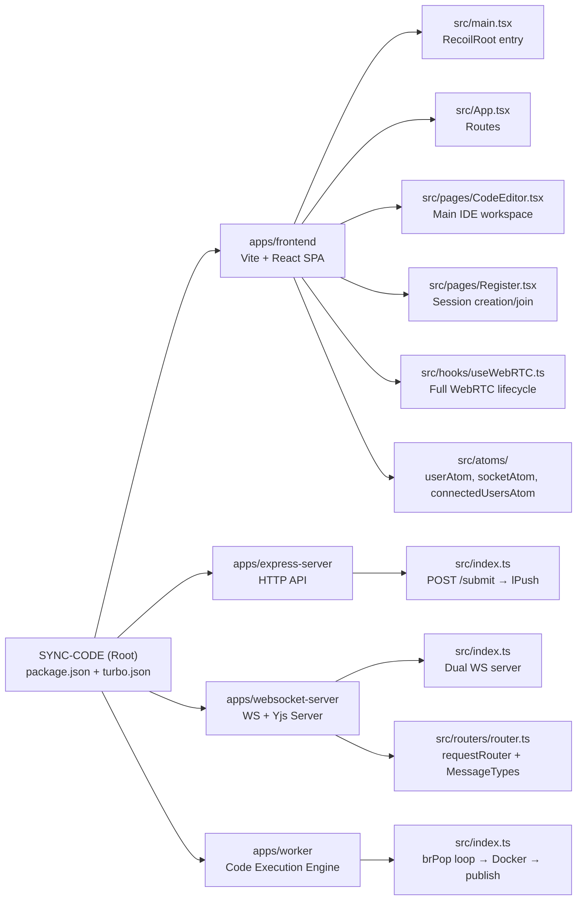
```mermaid
graph LR
    ROOT["SYNC-CODE (Root)\npackage.json + turbo.json"]

    ROOT --> FE["apps/frontend\nVite + React SPA"]
    ROOT --> EX["apps/express-server\nHTTP API"]
    ROOT --> WS["apps/websocket-server\nWS + Yjs Server"]
    ROOT --> WK["apps/worker\nCode Execution Engine"]

    FE --> FE_MAIN["src/main.tsx\nRecoilRoot entry"]
    FE --> FE_APP["src/App.tsx\nRoutes"]
    FE --> FE_CE["src/pages/CodeEditor.tsx\nMain IDE workspace"]
    FE --> FE_REG["src/pages/Register.tsx\nSession creation/join"]
    FE --> FE_WR["src/hooks/useWebRTC.ts\nFull WebRTC lifecycle"]
    FE --> FE_AT["src/atoms/\nuserAtom, socketAtom, connectedUsersAtom"]

    EX --> EX_IDX["src/index.ts\nPOST /submit → lPush"]

    WS --> WS_IDX["src/index.ts\nDual WS server"]
    WS --> WS_RT["src/routers/router.ts\nrequestRouter + MessageTypes"]

    WK --> WK_IDX["src/index.ts\nbrPop loop → Docker → publish"]
```

---

## Architecture Deep Dives

### Dual WebSocket Strategy

The WebSocket server runs two completely separate HTTP servers to prevent heavy CRDT binary traffic from blocking application-level JSON signaling:

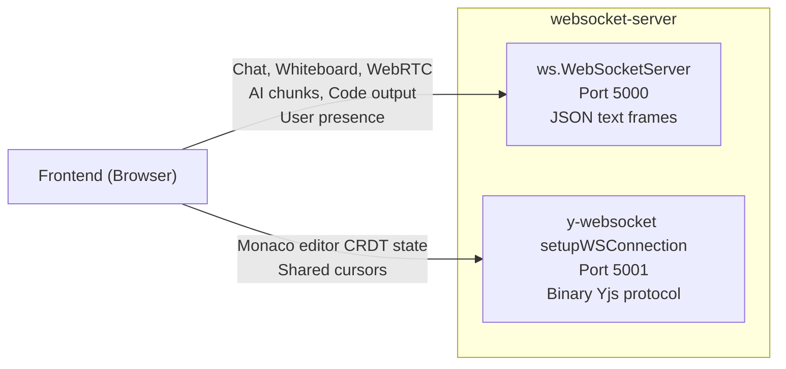
```mermaid
graph LR
    FE["Frontend (Browser)"]

    subgraph "websocket-server"
        WS5000["ws.WebSocketServer\nPort 5000\nJSON text frames"]
        WS5001["y-websocket setupWSConnection\nPort 5001\nBinary Yjs protocol"]
    end

    FE -- "Chat, Whiteboard, WebRTC\nAI chunks, Code output\nUser presence" --> WS5000
    FE -- "Monaco editor CRDT state\nShared cursors" --> WS5001
```

| Server | Port | Protocol | Handles |
|---|---|---|---|
| Application WS | 5000 | JSON text frames | Chat, whiteboard strokes, WebRTC offers/answers/ICE, AI chunks, code output, user presence |
| Yjs Sync WS | 5001 | Binary (Yjs protocol) | Monaco editor CRDT state, shared cursors |

---

### End-to-End Code Execution Pipeline

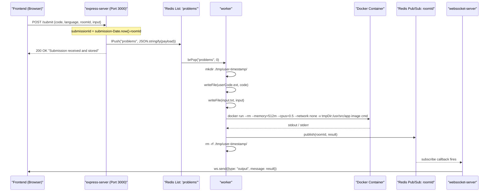
```mermaid
sequenceDiagram
    participant FE as "Frontend (Browser)"
    participant EX as "express-server (Port 3000)"
    participant RQ as "Redis List: 'problems'"
    participant WK as "worker"
    participant DC as "Docker Container"
    participant RP as "Redis Pub/Sub: roomId"
    participant WS as "websocket-server"

    FE->>EX: POST /submit {code, language, roomId, input}
    Note over EX: submissionId = submission-Date.now()-roomId
    EX->>RQ: lPush("problems", JSON.stringify(payload))
    EX-->>FE: 200 OK "Submission received and stored"

    RQ->>WK: brPop("problems", 0)
    WK->>WK: mkdir ./tmp/user-timestamp/
    WK->>WK: writeFile(userCode.ext, code)
    WK->>WK: writeFile(input.txt, input)
    WK->>DC: docker run --rm --memory=512m --cpus=0.5 --network none -v tmpDir:/usr/src/app image cmd
    DC-->>WK: stdout / stderr
    WK->>RP: publish(roomId, result)
    WK->>WK: rm -rf ./tmp/user-timestamp/

    RP-->>WS: subscribe callback fires
    WS->>FE: ws.send({type: "output", message: result})
```

**Supported Languages:**

| Language | Docker Image | Execution Command |
|---|---|---|
| JavaScript | `node:18-alpine` | `node userCode.js input.txt` |
| Python | `python:3.9-alpine` | `python userCode.py input.txt` |
| C++ | `gcc:latest` | `sh -c "g++ userCode.cpp -o a.out && ./a.out < input.txt"` |
| Go | `golang:1.20-alpine` | `sh -c "go run userCode.go < input.txt"` |

---

### Redis: Queue + Pub/Sub + Hash

Redis serves three distinct roles:

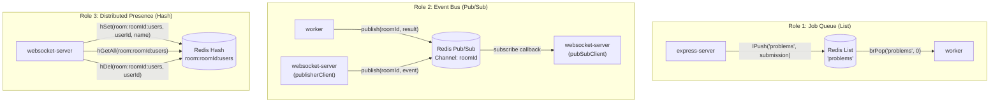
```mermaid
graph TD
    subgraph "Role 1: Job Queue (List)"
        EX["express-server"] -- "lPush('problems', submission)" --> RL[("Redis List\n'problems'")]
        RL -- "brPop('problems', 0)" --> WK["worker"]
    end

    subgraph "Role 2: Event Bus (Pub/Sub)"
        WK2["worker"] -- "publish(roomId, result)" --> RP[("Redis Pub/Sub\nChannel: roomId")]
        WS["websocket-server\n(publisherClient)"] -- "publish(roomId, event)" --> RP
        RP -- "subscribe callback" --> WS2["websocket-server\n(pubSubClient)"]
    end

    subgraph "Role 3: Distributed Presence (Hash)"
        WS3["websocket-server"] -- "hSet(room:roomId:users, userId, name)" --> RH[("Redis Hash\nroom:roomId:users")]
        WS3 -- "hGetAll(room:roomId:users)" --> RH
        WS3 -- "hDel(room:roomId:users, userId)" --> RH
    end
```

**Pub/Sub message envelope format:**

```
Broadcast:  { type: "broadcast", excludeUserId: string | null, data: any }
Direct:     { type: "direct",    targetUserId: string,         data: any }
```

The `pubSubClient` (subscriber) and `publisherClient` (publisher/hash ops) are two separate Redis client instances — required because a Redis client in subscribe mode cannot issue other commands.

---

### WebSocket Connection Lifecycle & Room Management

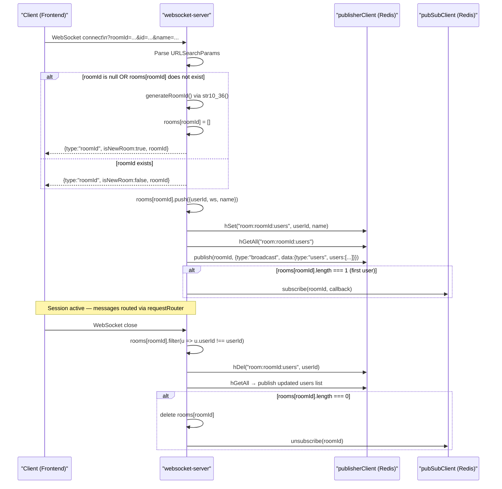
```mermaid
sequenceDiagram
    participant C as "Client (Frontend)"
    participant S as "websocket-server"
    participant PUB as "publisherClient (Redis)"
    participant SUB as "pubSubClient (Redis)"

    C->>S: WebSocket connect\n?roomId=...&id=...&name=...
    S->>S: Parse URLSearchParams

    alt roomId is null OR rooms[roomId] does not exist
        S->>S: generateRoomId() via str10_36()
        S->>S: rooms[roomId] = []
        S-->>C: {type:"roomId", isNewRoom:true, roomId}
    else roomId exists
        S-->>C: {type:"roomId", isNewRoom:false, roomId}
    end

    S->>S: rooms[roomId].push({userId, ws, name})
    S->>PUB: hSet("room:roomId:users", userId, name)
    S->>PUB: hGetAll("room:roomId:users")
    S->>PUB: publish(roomId, {type:"broadcast", data:{type:"users", users:[...]}})

    alt rooms[roomId].length === 1 (first user)
        S->>SUB: subscribe(roomId, callback)
    end

    Note over C,S: Session active — messages routed via requestRouter

    C->>S: WebSocket close
    S->>S: rooms[roomId].filter(u => u.userId !== userId)
    S->>PUB: hDel("room:roomId:users", userId)
    S->>PUB: hGetAll → publish updated users list

    alt rooms[roomId].length === 0
        S->>S: delete rooms[roomId]
        S->>SUB: unsubscribe(roomId)
    end
```

**Disconnection cleanup flowchart:**

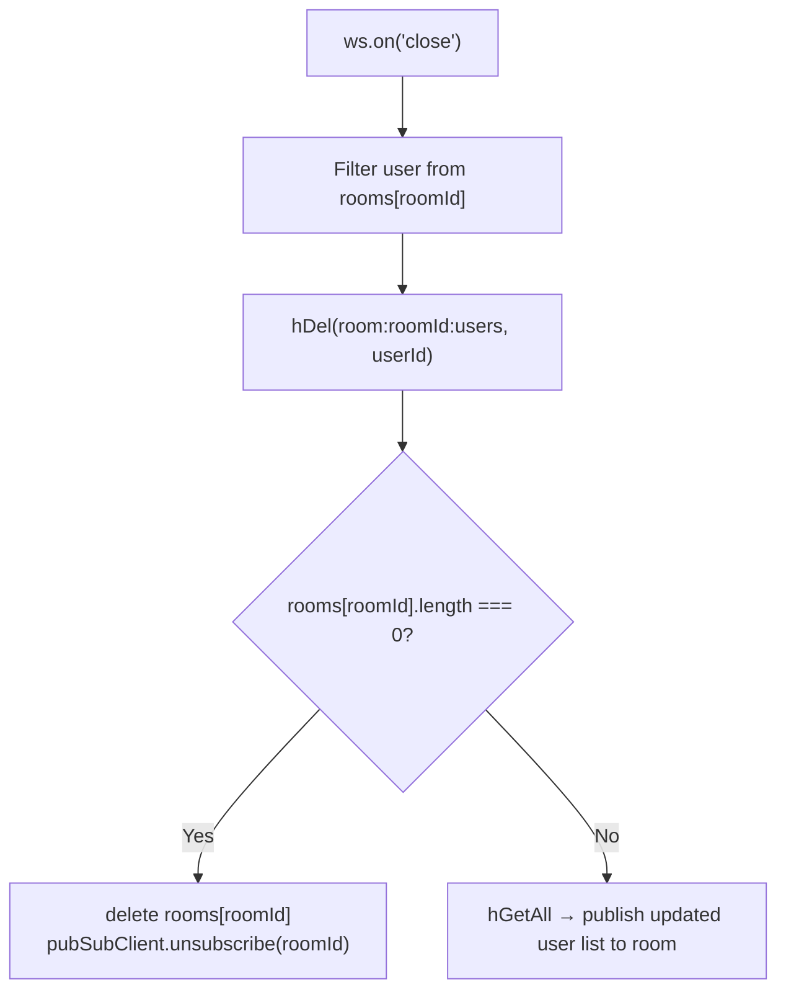
```mermaid
flowchart TD
    E["ws.on('close')"] --> F["Filter user from rooms[roomId]"]
    F --> D["hDel(room:roomId:users, userId)"]
    D --> CH{"rooms[roomId].length === 0?"}
    CH -- "Yes" --> CL["delete rooms[roomId]\npubSubClient.unsubscribe(roomId)"]
    CH -- "No" --> BR["hGetAll → publish updated user list to room"]
```

---

### Message Router

All incoming WebSocket messages on Port 5000 are dispatched through `requestRouter` — a record of `MessageType → MessageHandler` functions. Each handler publishes to Redis (broadcast or direct), never writing to WebSocket connections directly.

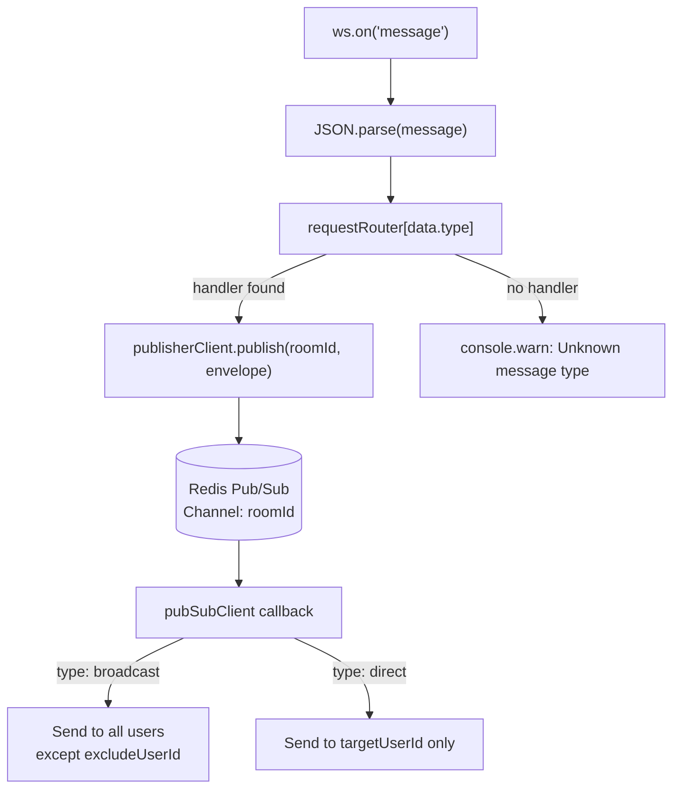
```mermaid
graph TD
    MSG["ws.on('message')"] --> PARSE["JSON.parse(message)"]
    PARSE --> LOOKUP["requestRouter[data.type]"]
    LOOKUP -- "handler found" --> PUB["publisherClient.publish(roomId, envelope)"]
    LOOKUP -- "no handler" --> WARN["console.warn: Unknown message type"]
    PUB --> RP[("Redis Pub/Sub\nChannel: roomId")]
    RP --> SUB["pubSubClient callback"]
    SUB -- "type: broadcast" --> BCAST["Send to all users\nexcept excludeUserId"]
    SUB -- "type: direct" --> DIRECT["Send to targetUserId only"]
```

**Complete MessageTypes reference:**

| Message Type | Delivery | Purpose |
|---|---|---|
| `requestToGetUsers` | Broadcast | Fetch and broadcast current room user list |
| `requestForAllData` | Direct (to existing user) | New joiner requests current editor state |
| `allData` | Direct (to new joiner) | Existing user sends back code/language/input/output |
| `code` | Broadcast (excl. sender) | Sync Monaco editor content |
| `input` | Broadcast (excl. sender) | Sync stdin input field |
| `language` | Broadcast (excl. sender) | Sync selected programming language |
| `submitBtnStatus` | Broadcast (excl. sender) | Sync "Run" button loading state |
| `users` | Broadcast (excl. sender) | Sync participant list |
| `cursorPosition` | Broadcast (excl. sender) | Sync editor cursor position |
| `chat_message` | Broadcast (excl. sender) | Text and image chat messages |
| `whiteboard_stroke` | Broadcast (excl. sender) | Canvas stroke coordinates |
| `whiteboard_clear` | Broadcast (excl. sender) | Clear the whiteboard |
| `whiteboard_cursor` | Broadcast (excl. sender) | Remote cursor position on whiteboard |
| `webrtc_offer` | Direct (to targetUserId) | WebRTC SDP offer for P2P video/audio |
| `webrtc_answer` | Direct (to targetUserId) | WebRTC SDP answer |
| `webrtc_ice_candidate` | Direct (to targetUserId) | WebRTC ICE candidate |
| `ask_ai` | Streaming broadcast | Trigger Gemini AI pipeline |

---

### Real-Time Collaboration — Yjs CRDTs

Instead of sending raw code strings (which causes conflicts when two users type simultaneously), SYNC-CODE uses **Yjs** — a CRDT library where every character insertion/deletion is an operation that can be merged with any other operation in any order, always producing the same result.

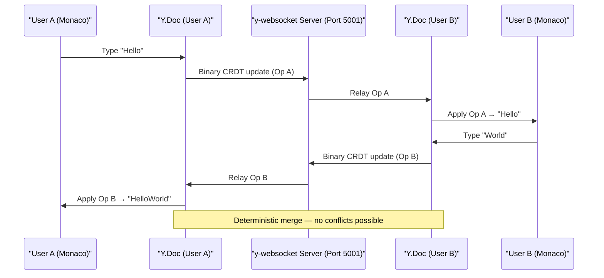
```mermaid
sequenceDiagram
    participant UA as "User A (Monaco)"
    participant YA as "Y.Doc (User A)"
    participant YS as "y-websocket Server (Port 5001)"
    participant YB as "Y.Doc (User B)"
    participant UB as "User B (Monaco)"

    UA->>YA: Type "Hello"
    YA->>YS: Binary CRDT update (Op A)
    YS->>YB: Relay Op A
    YB->>UB: Apply Op A → "Hello"

    UB->>YB: Type "World"
    YB->>YS: Binary CRDT update (Op B)
    YS->>YA: Relay Op B
    YA->>UA: Apply Op B → "HelloWorld"

    Note over YA,YB: Deterministic merge — no conflicts possible
```

- `Y.Doc` — the shared document instance
- `WebsocketProvider` — connects the local `Y.Doc` to the Yjs server on Port 5001
- `MonacoBinding` — binds the `Y.Text` type within `Y.Doc` to the Monaco Editor instance, enabling shared cursors and text sync

---

### Docker Sandboxing

Every code submission runs inside an ephemeral Docker container. The worker constructs the command dynamically:

```
docker run --rm
           --memory="512m"
           --cpus="0.5"
           --network none
           -v "${dockerPath}:/usr/src/app"
           -w /usr/src/app
           {image}
           {executionCommand}
```

**Security constraints:**

| Flag | Value | Protection |
|---|---|---|
| `--network none` | — | Prevents outbound HTTP, port scanning, and network attacks |
| `--memory` | `512m` | Prevents OOM attacks and memory exhaustion on the host |
| `--cpus` | `0.5` | Prevents CPU hogging and infinite loop denial-of-service |
| `--rm` | — | Container deleted after execution — no state persists |
| Timeout | 20 seconds | `child_process.exec` timeout kills hung containers |
| Volume mount | `-v tmpDir:/usr/src/app` | Code injected via volume — no host filesystem access |

**Temp directory isolation:**

Each submission gets a unique directory `./tmp/user-{Date.now()}/`. 100 concurrent submissions → 100 isolated directories, zero collisions. The directory is deleted with `fs.rm(codeDir, { recursive: true, force: true })` regardless of success or failure.

**Path normalization:** On Windows hosts, backslashes in the directory path are converted to forward slashes before being passed to Docker volume mount syntax.

**Worker Dockerfile:** The worker container itself runs as a non-root user (`myuser`) and pre-installs Python 3, GCC (`build-essential`), and Go for internal tooling, while actual user code runs in separate language-specific containers.

---

### WebRTC Peer-to-Peer Audio/Video

SYNC-CODE implements a **full mesh WebRTC topology** — every participant maintains a direct `RTCPeerConnection` with every other participant. The WebSocket server acts only as a signaling relay; media data flows directly browser-to-browser.

**ICE Servers:**
- `stun:stun.l.google.com:19302`
- `stun:stun1.l.google.com:19302`

**Signaling flow:**

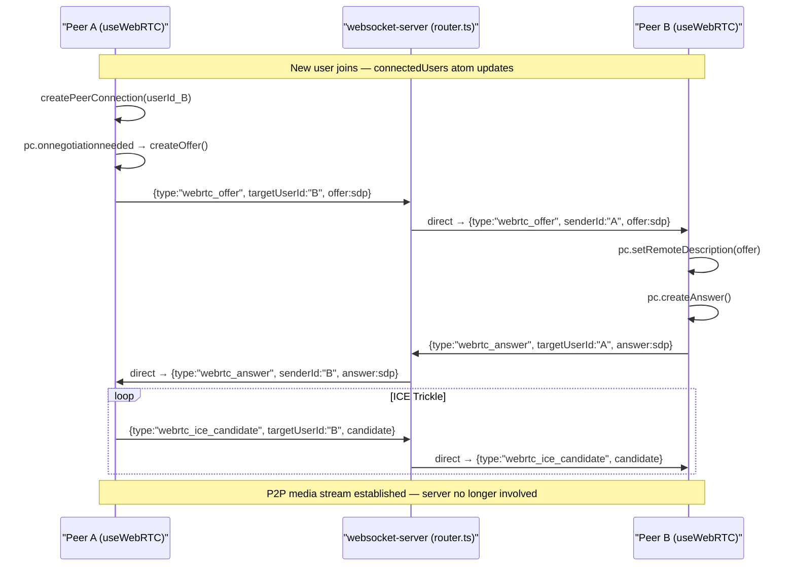
```mermaid
sequenceDiagram
    participant PA as "Peer A (useWebRTC)"
    participant WS as "websocket-server (router.ts)"
    participant PB as "Peer B (useWebRTC)"

    Note over PA,PB: New user joins — connectedUsers atom updates
    PA->>PA: createPeerConnection(userId_B)
    PA->>PA: pc.onnegotiationneeded → createOffer()
    PA->>WS: {type:"webrtc_offer", targetUserId:"B", offer:sdp}
    WS->>PB: direct → {type:"webrtc_offer", senderId:"A", offer:sdp}

    PB->>PB: pc.setRemoteDescription(offer)
    PB->>PB: pc.createAnswer()
    PB->>WS: {type:"webrtc_answer", targetUserId:"A", answer:sdp}
    WS->>PA: direct → {type:"webrtc_answer", senderId:"B", answer:sdp}

    loop ICE Trickle
        PA->>WS: {type:"webrtc_ice_candidate", targetUserId:"B", candidate}
        WS->>PB: direct → {type:"webrtc_ice_candidate", candidate}
    end

    Note over PA,PB: P2P media stream established — server no longer involved
```

**Perfect Negotiation Pattern** (prevents "glare" when both peers send offers simultaneously):

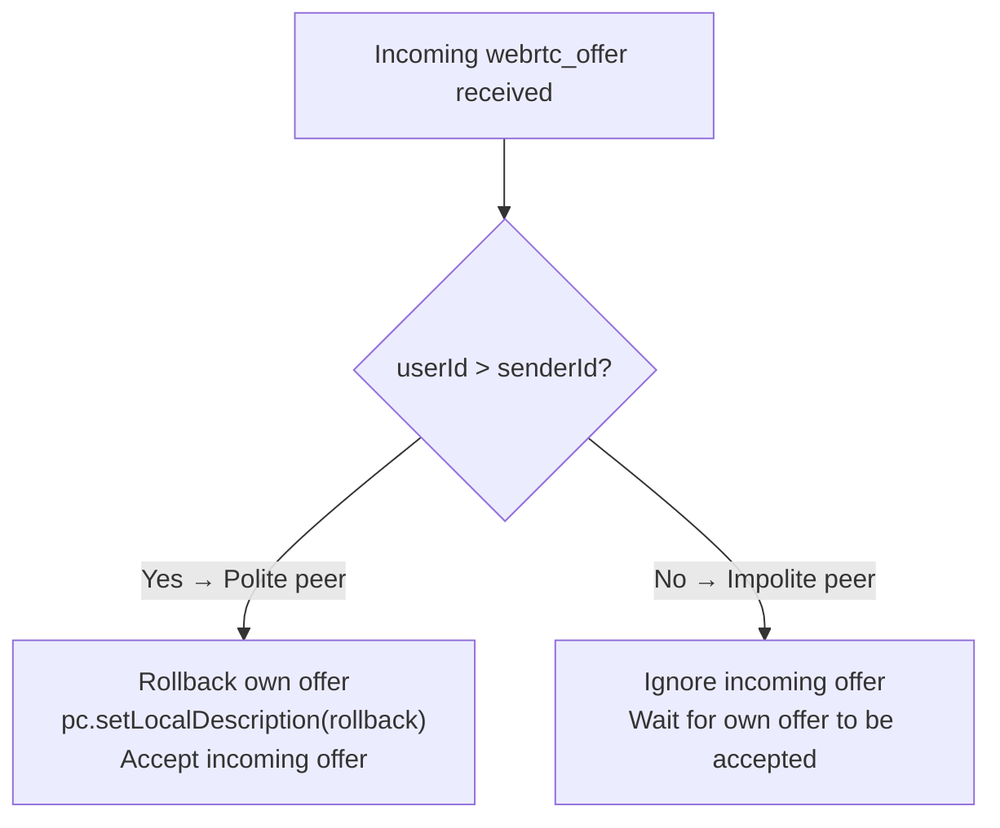
```mermaid
flowchart TD
    OFFER["Incoming webrtc_offer received"] --> COMPARE{"userId > senderId?"}
    COMPARE -- "Yes → Polite peer" --> ROLLBACK["Rollback own offer\npc.setLocalDescription(rollback)\nAccept incoming offer"]
    COMPARE -- "No → Impolite peer" --> IGNORE["Ignore incoming offer\nWait for own offer to be accepted"]
```

**Track management:**
- `toggleMic` / `toggleVideo` — sets `track.enabled` directly, no renegotiation needed
- On new user join — `useEffect` watches `connectedUsers` atom, calls `createPeerConnection(userId)`
- On remote track received — removes "zombie" tracks of the same kind, creates a new `MediaStream` reference to force React re-render
- On disconnect — `oniceconnectionstatechange` detects `disconnected`/`failed` state, removes stream from `remoteStreams`

---

### AI Pair Programmer (Gemini)

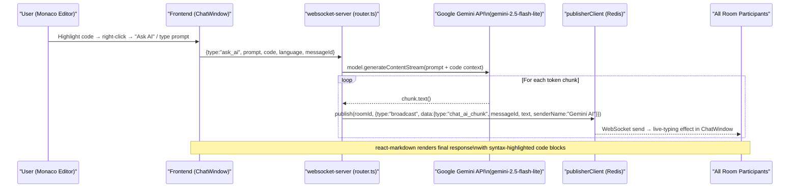
```mermaid
sequenceDiagram
    participant U as "User (Monaco Editor)"
    participant FE as "Frontend (ChatWindow)"
    participant WS as "websocket-server (router.ts)"
    participant G as "Google Gemini API\n(gemini-2.5-flash-lite)"
    participant PUB as "publisherClient (Redis)"
    participant ALL as "All Room Participants"

    U->>FE: Highlight code → right-click → "Ask AI" / type prompt
    FE->>WS: {type:"ask_ai", prompt, code, language, messageId}

    WS->>G: model.generateContentStream(prompt + code context)

    loop For each token chunk
        G-->>WS: chunk.text()
        WS->>PUB: publish(roomId, {type:"broadcast", data:{type:"chat_ai_chunk", messageId, text, senderName:"Gemini AI"}})
        PUB-->>ALL: WebSocket send → live-typing effect in ChatWindow
    end

    Note over FE,ALL: react-markdown renders final response\nwith syntax-highlighted code blocks
```

- The `GEMINI_API_KEY` is loaded server-side from `process.env` — never exposed to the browser
- If `GEMINI_API_KEY` is not set, the server publishes a `chat_ai_error` message instead of crashing
- AI messages are flagged with `isAi: true` and rendered with a distinct purple theme in the chat UI

---

### Shared Whiteboard

The `Whiteboard` component uses two `<canvas>` layers:
- **Main Canvas** — persistent strokes rendered with `quadraticCurveTo` for smooth curves
- **Overlay Canvas** — active drawing preview and remote cursor rendering

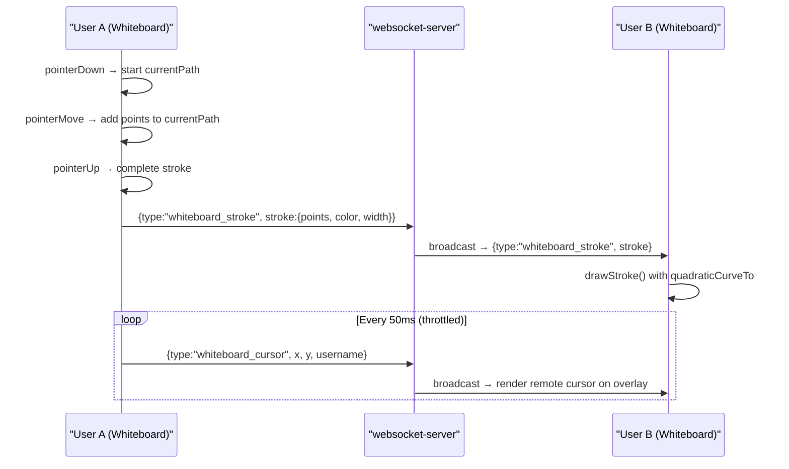
```mermaid
sequenceDiagram
    participant UA as "User A (Whiteboard)"
    participant WS as "websocket-server"
    participant UB as "User B (Whiteboard)"

    UA->>UA: pointerDown → start currentPath
    UA->>UA: pointerMove → add points to currentPath
    UA->>UA: pointerUp → complete stroke

    UA->>WS: {type:"whiteboard_stroke", stroke:{points, color, width}}
    WS->>UB: broadcast → {type:"whiteboard_stroke", stroke}
    UB->>UB: drawStroke() with quadraticCurveTo

    loop Every 50ms (throttled)
        UA->>WS: {type:"whiteboard_cursor", x, y, username}
        WS->>UB: broadcast → render remote cursor on overlay
    end
```

**Cursor throttling:** Mouse movement fires hundreds of times per second. A 50ms throttle gate reduces network traffic by ~95% while keeping cursors visually smooth.

---

### Chat & Image Sharing

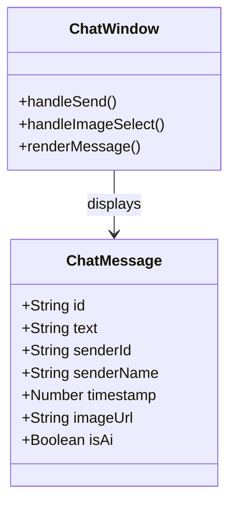
```mermaid
classDiagram
    class ChatMessage {
        +String id
        +String text
        +String senderId
        +String senderName
        +Number timestamp
        +String imageUrl
        +Boolean isAi
    }
    class ChatWindow {
        +handleSend()
        +handleImageSelect()
        +renderMessage()
    }
    ChatWindow --> ChatMessage : displays
```

**Image compression pipeline** (prevents WebSocket payload overflow):
1. Image loaded into `<canvas>` and scaled to max 800px on longest dimension
2. Exported as JPEG Base64 string at 0.6 quality
3. Sent as `imageUrl` field in `chat_message` payload

---

### Session Registration & Routing

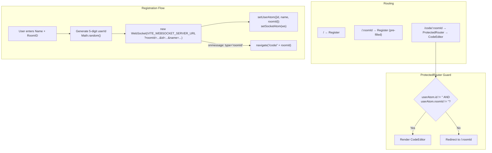
```mermaid
graph TD
    subgraph "Routing"
        R1["/ → Register"]
        R2["/:roomId → Register (pre-filled)"]
        R3["/code/:roomId → ProtectedRouter → CodeEditor"]
    end

    subgraph "ProtectedRouter Guard"
        CHECK{"userAtom.id != '' AND\nuserAtom.roomId != ''?"}
        RENDER["Render CodeEditor"]
        REDIRECT["Redirect to /:roomId"]
    end

    subgraph "Registration Flow"
        UI["User enters Name + RoomID"]
        GEN["Generate 5-digit userId\nMath.random()"]
        WS_CONN["new WebSocket(VITE_WEBSOCKET_SERVER_URL\n?roomId=...&id=...&name=...)"]
        ATOM["setUserAtom({id, name, roomId})\nsetSocketAtom(ws)"]
        NAV["navigate('/code/' + roomId)"]
    end

    R3 --> CHECK
    CHECK -- "Yes" --> RENDER
    CHECK -- "No" --> REDIRECT

    UI --> GEN --> WS_CONN --> ATOM
    WS_CONN -- "onmessage: type='roomId'" --> NAV
```

**WebSocket handshake:** The server responds with `{type: "roomId", isNewRoom: boolean, roomId}`. For new rooms, the server generates the ID using `hyperdyperid`'s `str10_36()` (10-character base-36 string). The client navigates to `/code/:roomId` only after receiving this confirmation.

---

### State Synchronization for New Joiners

When a new user joins an existing room, they lack the current editor state (code, language, input, output). A request-response pattern handles this:

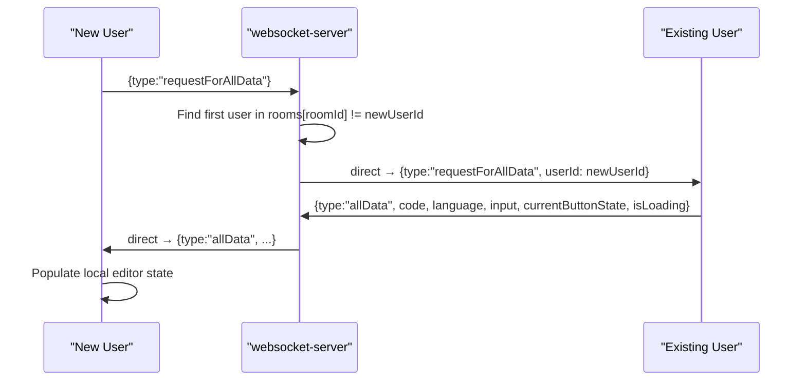
```mermaid
sequenceDiagram
    participant NEW as "New User"
    participant WS as "websocket-server"
    participant OLD as "Existing User"

    NEW->>WS: {type:"requestForAllData"}
    WS->>WS: Find first user in rooms[roomId] != newUserId
    WS->>OLD: direct → {type:"requestForAllData", userId: newUserId}
    OLD->>WS: {type:"allData", code, language, input, currentButtonState, isLoading}
    WS->>NEW: direct → {type:"allData", ...}
    NEW->>NEW: Populate local editor state
```

Note: The Monaco editor content itself is synchronized automatically by Yjs on Port 5001. The `allData` exchange covers non-Yjs metadata (language selection, stdin input, output logs, button state).

---

### Worker Resilience & Retry Logic

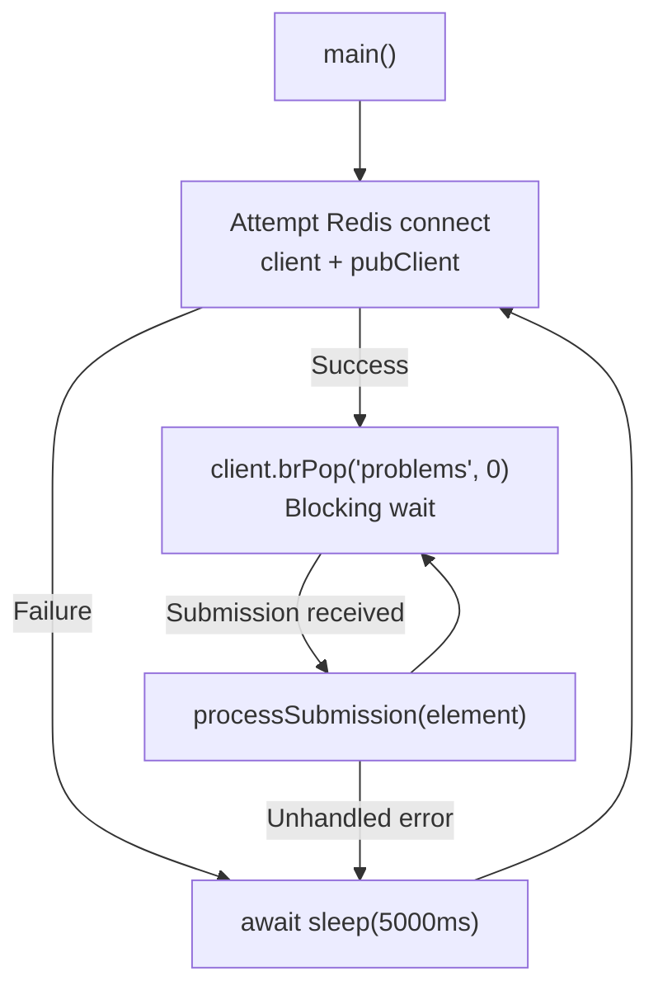
```mermaid
flowchart TD
    START["main()"] --> CONN["Attempt Redis connect\nclient + pubClient"]
    CONN -- "Success" --> POP["client.brPop('problems', 0)\nBlocking wait"]
    POP -- "Submission received" --> PROC["processSubmission(element)"]
    PROC --> POP
    CONN -- "Failure" --> WAIT["await sleep(5000ms)"]
    WAIT --> CONN
    PROC -- "Unhandled error" --> WAIT
```

The `main()` function wraps everything in a `while(true)` loop. If Redis connectivity is lost at any point, the worker logs the error and retries after a 5-second backoff — ensuring no permanent crash from transient infrastructure issues.

---

## Turborepo & Monorepo Tooling

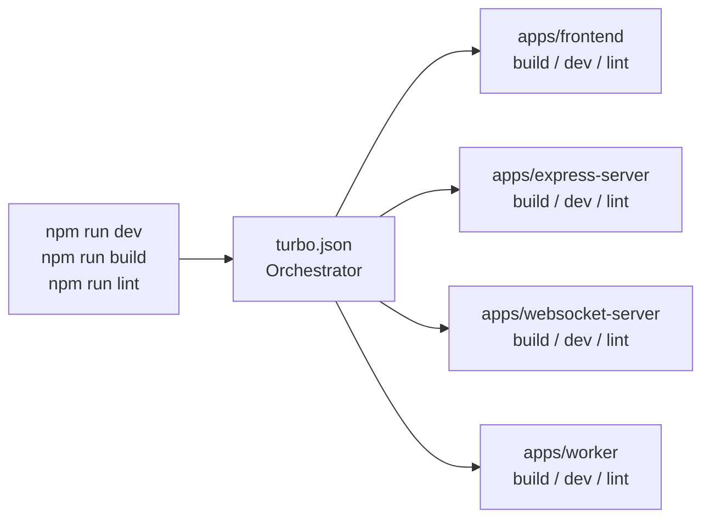
```mermaid
graph LR
    CMD["npm run dev\nnpm run build\nnpm run lint"] --> TURBO["turbo.json\nOrchestrator"]
    TURBO --> FE["apps/frontend\nbuild / dev / lint"]
    TURBO --> EX["apps/express-server\nbuild / dev / lint"]
    TURBO --> WS["apps/websocket-server\nbuild / dev / lint"]
    TURBO --> WK["apps/worker\nbuild / dev / lint"]
```

**`turbo.json` task pipeline:**

```json
{
  "tasks": {
    "build":       { "outputs": ["dist/**"] },
    "check-types": { "dependsOn": ["^check-types"] },
    "dev":         { "persistent": true, "cache": false }
  }
}
```

| Task | Command | Behavior |
|---|---|---|
| `dev` | `npm run dev` | Starts all 4 services concurrently with hot-reload. Cache disabled for real-time feedback. |
| `build` | `npm run build` | Compiles all TypeScript to `dist/`. Turborepo caches — unchanged services are skipped. |
| `lint` | `npm run lint` | Runs ESLint across all workspaces. |
| `format` | `npm run format` | Runs `prettier --write "**/*.{ts,tsx,md}"` across all files. |

**TypeScript configuration per service:**

| Service | Module | Target | Output |
|---|---|---|---|
| `express-server` | CommonJS | ES2016 | `./dist` |
| `websocket-server` | CommonJS | ES2016 | `./dist` |
| `worker` | CommonJS | ES2016 | `./dist` |
| `frontend` | ESNext (Vite) | ESNext | Vite handles bundling |

The frontend uses path aliases (`@/*` → `./src/*`) configured in `tsconfig.app.json`.

---

## Project Structure

```
SYNC-CODE/
├── apps/
│   ├── frontend/
│   │   ├── src/
│   │   │   ├── atoms/
│   │   │   │   ├── userAtom.ts           # {id, name, roomId}
│   │   │   │   ├── socketAtom.ts         # WebSocket | null
│   │   │   │   └── connectedUsersAtom.ts # Active room participants
│   │   │   ├── pages/
│   │   │   │   ├── CodeEditor.tsx        # Main IDE workspace
│   │   │   │   └── Register.tsx          # Session creation/join + WS handshake
│   │   │   ├── hooks/
│   │   │   │   └── useWebRTC.ts          # Full WebRTC lifecycle hook
│   │   │   ├── components/
│   │   │   │   ├── ChatWindow.tsx         # Chat + AI streaming UI
│   │   │   │   ├── Whiteboard.tsx         # Dual-canvas collaborative drawing
│   │   │   │   ├── UsersList.tsx          # Participant list + video feeds
│   │   │   │   ├── CodeEditorHeader.tsx   # Language selector, run button, view toggle
│   │   │   │   ├── CodeOutput.tsx         # Terminal output panel
│   │   │   │   ├── LanguageDropDown.tsx   # JS / Python / C++ / Go selector
│   │   │   │   ├── FadedGrid.tsx          # Background visual effect
│   │   │   │   └── ui/                    # Shadcn/Radix primitives (Button, Card, Input...)
│   │   │   ├── middleware/
│   │   │   │   └── ProtectedRouter.tsx    # Route guard for /code/:roomId
│   │   │   ├── lib/
│   │   │   │   └── utils.ts               # cn() helper (clsx + twMerge)
│   │   │   ├── utils/
│   │   │   │   └── monacoSnippets.ts      # Language-specific editor snippets
│   │   │   ├── App.tsx                    # Route definitions
│   │   │   └── main.tsx                   # RecoilRoot entry point
│   │   ├── vite.config.ts
│   │   ├── tailwind.config.js
│   │   └── package.json
│   │
│   ├── express-server/
│   │   ├── src/
│   │   │   └── index.ts                   # POST /submit → lPush("problems")
│   │   ├── Dockerfile                     # Multi-stage: builder + runner
│   │   └── package.json
│   │
│   ├── websocket-server/
│   │   ├── src/
│   │   │   ├── index.ts                   # Dual WS server (Port 5000 + 5001)
│   │   │   └── routers/
│   │   │       └── router.ts              # requestRouter + MessageTypes + Gemini AI
│   │   ├── Dockerfile
│   │   └── package.json
│   │
│   └── worker/
│       ├── src/
│       │   └── index.ts                   # brPop loop → Docker exec → Redis publish
│       ├── Dockerfile                     # node:18 + python3 + gcc + golang, non-root user
│       └── package.json
│
├── package.json                           # Root workspaces + Turbo scripts
├── turbo.json                             # Turborepo pipeline config
└── README.md
```

---

## Getting Started

### Prerequisites

- **Node.js** `>= 18`
- **npm** `>= 10.8.1`
- **Docker Desktop** — required for the `worker` service to execute code
- **Redis** — local instance or Docker container

### Installation

```bash
# 1. Clone the repository
git clone https://github.com/harshitzofficial/SYNC-CODE.git
cd SYNC-CODE

# 2. Install all workspace dependencies
npm install

# 3. Start Redis
docker run -d -p 6379:6379 --name redis redis

# 4. Configure environment variables (see section below)

# 5. Start all services concurrently
npm run dev
```

### Access Points

| Service | URL |
|---|---|
| Frontend | http://localhost:5173 |
| Express API | http://localhost:3000 |
| WebSocket (App) | ws://localhost:5000 |
| WebSocket (Yjs) | ws://localhost:5001 |

### Build for Production

```bash
npm run build
```

### Running Individual Services

```bash
cd apps/frontend          && npm run dev
cd apps/express-server    && npm run dev
cd apps/websocket-server  && npm run dev
cd apps/worker            && npm run dev
```

---

## Environment Variables

### `apps/express-server/.env`

```env
PORT=3000
REDIS_URL=redis://localhost:6379
```

### `apps/websocket-server/.env`

```env
PORT=5000
REDIS_URL=redis://localhost:6379
GEMINI_API_KEY=your_google_gemini_api_key_here
```

### `apps/worker/.env`

```env
REDIS_URL=redis://localhost:6379
```

### `apps/frontend/.env`

```env
VITE_API_URL=http://localhost:3000
VITE_WEBSOCKET_SERVER_URL=ws://localhost:5000
VITE_YJS_WS_URL=ws://localhost:5001
```

> Never commit `.env` files. They are excluded via `.gitignore`.

---

## Deployment

| Service | Platform |
|---|---|---|
| `frontend` | **Vercel** | 
| `express-server` | **AWS EC2** | 
| `websocket-server` | **AWS EC2** | 
| `worker` | **AWS EC2** | 
**Docker build example:**

---

## Glossary

| Term | Definition |
|---|---|
| **CRDT** | Conflict-free Replicated Data Type — a data structure that can be merged across distributed nodes without conflicts. Used by Yjs for the shared editor. |
| **Yjs** | A CRDT library. `Y.Doc` is the shared document; `MonacoBinding` connects it to Monaco Editor; `WebsocketProvider` syncs it via Port 5001. |
| **brPop** | Redis blocking list pop — the worker waits indefinitely (timeout=0) until a job appears in the `problems` list. |
| **lPush** | Redis list left-push — the express-server enqueues submissions to the front of the `problems` list. |
| **Perfect Negotiation** | A WebRTC pattern to resolve "glare" (simultaneous offers). Peers are assigned polite/impolite roles based on `userId` string comparison. |
| **Mesh Topology** | Every WebRTC participant connects directly to every other participant — O(n²) connections, no media server. |
| **pubSubClient** | The Redis client instance dedicated to `subscribe()` calls. Cannot issue other commands while subscribed. |
| **publisherClient** | The Redis client instance used for `publish()`, `hSet()`, `hGetAll()`, and `hDel()`. |
| **str10_36** | Function from `hyperdyperid` that generates a 10-character base-36 string used as room IDs. |
| **requestRouter** | A `Record<MessageType, MessageHandler>` object in `router.ts` that dispatches incoming WebSocket messages to the correct handler. |
| **First-In-Subscribes** | Only the first user to join a room triggers `pubSubClient.subscribe(roomId)`. Subsequent users reuse the existing subscription. |
| **submissionId** | Format: `submission-${Date.now()}-${roomId}`. Uniquely identifies each code execution job. |

---

Built by **Harshit Singh**

https://deepwiki.com/badge-maker?url=https%3A%2F%2Fdeepwiki.com%2Fharshitzofficial%2FSYNC-CODE
