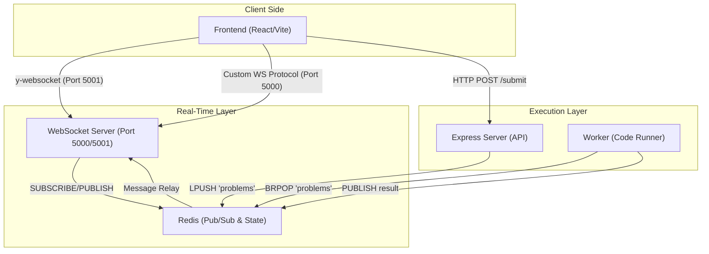
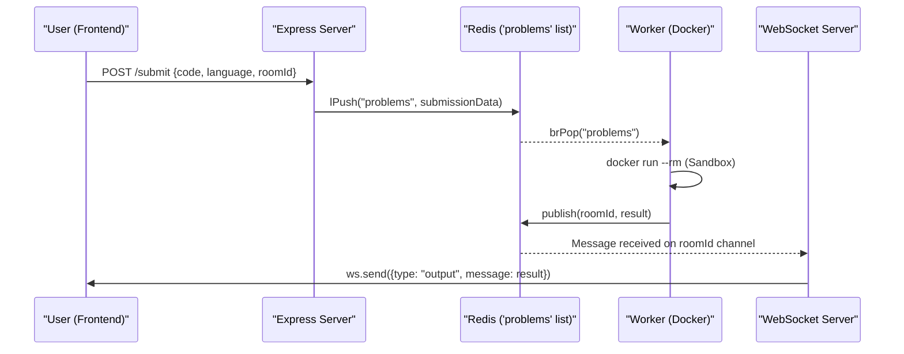
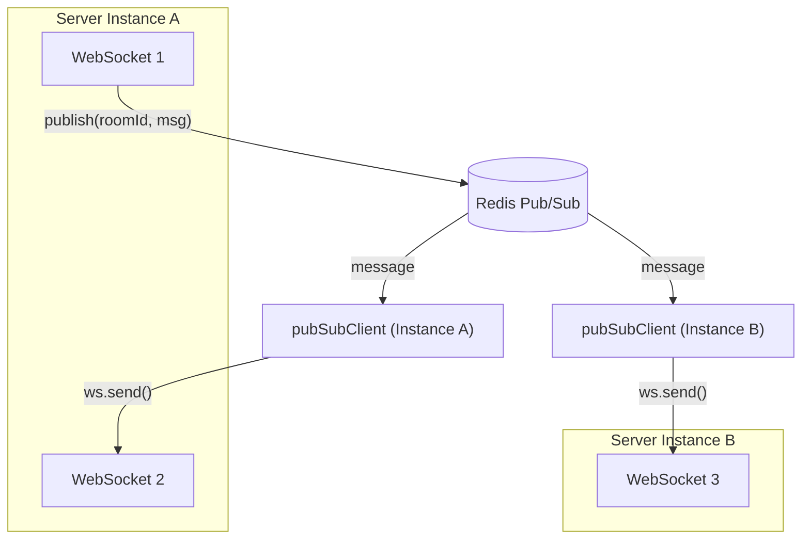
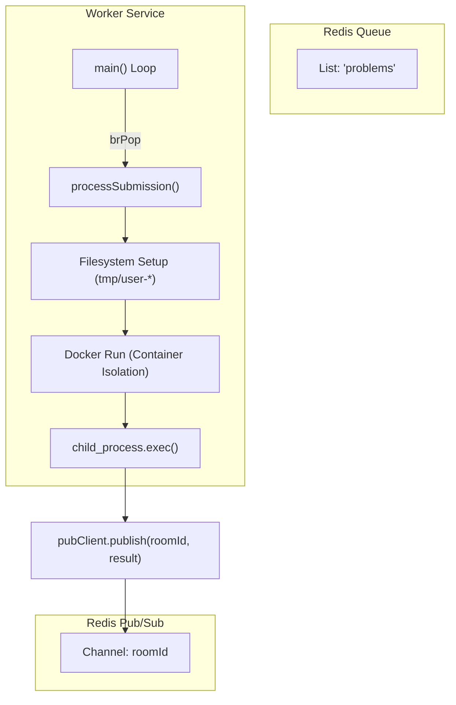
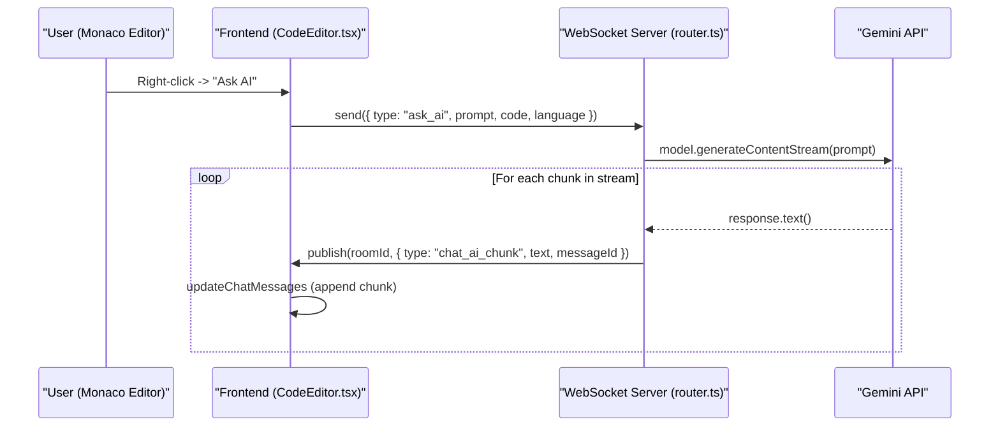
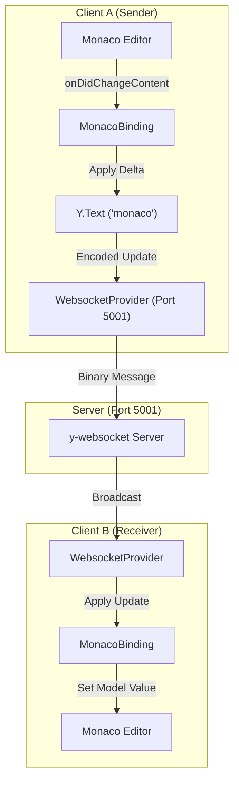

# SYNC-CODE

A high-performance, real-time collaborative coding platform designed for seamless teamwork and remote technical interviews. SYNC-CODE integrates real-time text synchronization, multi-user whiteboard collaboration, instant messaging, AI-assisted pair programming, and sandboxed code execution across multiple programming languages.

Built as a modern distributed system, it leverages **CRDTs (Conflict-free Replicated Data Types)** for document consistency and a **Redis-backed messaging architecture** to ensure low-latency communication between users.

---

## Table of Contents

- [Core Capabilities](#core-capabilities)
- [System Architecture](#system-architecture)
- [Monorepo Structure & Tooling](#monorepo-structure--tooling)
- [Getting Started & Local Development](#getting-started--local-development)
- [WebSocket Server](#websocket-server)
  - [Message Router & Protocol](#message-router--protocol)
- [Express Server (Submission API)](#express-server-submission-api)
- [Code Execution Worker](#code-execution-worker)
- [Frontend Application](#frontend-application)
  - [Session Registration & Room Management](#session-registration--room-management)
  - [Collaborative Code Editor](#collaborative-code-editor)
  - [Collaborative Whiteboard](#collaborative-whiteboard)
  - [Group Chat & AI Assistant](#group-chat--ai-assistant)
  - [Video Conferencing (WebRTC)](#video-conferencing-webrtc)
  - [State Management & UI Components](#state-management--ui-components)
- [Real-Time Synchronization Architecture](#real-time-synchronization-architecture)
  - [Yjs CRDT & Monaco Binding](#yjs-crdt--monaco-binding)
  - [Redis Pub/Sub & Room Scaling](#redis-pubsub--room-scaling)
- [Glossary](#glossary)

---

## Core Capabilities

- **Real-time Collaboration**: Simultaneous code editing using `Yjs` and `Monaco Editor`.
- **Sandboxed Execution**: Remote code execution for JavaScript, Python, C++, and Go using Docker-based isolation.
- **Multi-modal Communication**: Integrated WebRTC video conferencing, group chat with image support, and a shared whiteboard.
- **AI Integration**: Context-aware coding assistance powered by Google Gemini.

---

## System Architecture

The platform is composed of four distinct services that interact via WebSockets, REST APIs, and Redis Pub/Sub.



### The Dual WebSocket Strategy

SYNC-CODE employs two distinct WebSocket pathways:

- **Port 5000 (Custom Protocol)**: Manages room lifecycle, user presence via Redis hashes, and ephemeral data like chat, whiteboard strokes, and WebRTC signaling.
- **Port 5001 (Yjs Provider)**: Utilizes `y-websocket` to provide CRDT synchronization specifically for the Monaco Editor, ensuring text edits merge seamlessly without collisions.

### Data Flow: Code Execution



1. **Submission**: The Express server receives the code and pushes it to the `problems` list in Redis.
2. **Consumption**: The Worker service uses `brPop` to wait for new submissions.
3. **Sandboxing**: The worker generates a unique directory and executes the code using `docker run` with strict resource limits (100MB RAM, 0.5 CPU).
4. **Result Delivery**: The worker publishes the output to a Redis channel named after the `roomId`. The WebSocket server relays the output to all connected clients.

### Redis Backbone & Horizontal Scaling

Redis is the primary mechanism for state synchronization across multiple server instances:

- **Presence**: User metadata is stored in hashes using the pattern `room:${roomId}:users`.
- **Scaling**: By using Redis Pub/Sub, a user connected to `WebSocket-Server-A` can receive messages from a user on `WebSocket-Server-B` as long as they are in the same `roomId` channel.
- **Persistence**: The worker uses Redis to decouple execution from the request-response cycle, allowing the system to handle bursts of submissions.

---

## Monorepo Structure & Tooling

SYNC-CODE utilizes a **Turborepo-based monorepo** to manage its four internal applications and shared configurations.

| Directory | Service | Technology Stack |
|:---|:---|:---|
| `apps/frontend` | Client UI | React, Vite, Tailwind CSS, Recoil, Monaco Editor |
| `apps/websocket-server` | Real-time Sync | Node.js, `ws`, `y-websocket`, Google Gemini SDK |
| `apps/express-server` | Submission API | Express, Redis Client |
| `apps/worker` | Code Execution | Node.js, Docker, Redis (BRPOP) |

### Core Scripts

| Command | Description |
|:---|:---|
| `npm run dev` | Starts all services in development mode using `turbo dev` (persistent, no caching) |
| `npm run build` | Compiles all applications, outputting artifacts to `dist/**` folders |
| `npm run lint` | Executes linting across the workspace |
| `npm run format` | Uses Prettier to format all `.ts`, `.tsx`, and `.md` files |

### Shared Dependencies

- **Yjs & y-websocket**: Used by `apps/frontend` and `apps/websocket-server` for CRDT-based text synchronization.
- **Redis**: Utilized by `apps/express-server`, `apps/worker`, and `apps/websocket-server` for task queuing and Pub/Sub messaging.
- **TypeScript**: Standardized across the repository for consistent transpilation.

---

## Getting Started & Local Development

### Prerequisites

- **Node.js**: Version 18.x or higher
- **Docker**: Required for the Redis backbone and for the `worker` service to manage execution environments
- **Redis**: Used as the primary message broker for Pub/Sub and task queuing
- **NPM**: Package manager for dependency installation

### Environment Configuration

Create `.env` files in the respective service directories:

#### Frontend (`apps/frontend/.env`)
```
VITE_BACKEND_URL=http://localhost:3000
VITE_WS_URL=ws://localhost:5000
VITE_YJS_WS_URL=ws://localhost:5001
```

#### Express Server (`apps/express-server/.env`)
```
PORT=3000
REDIS_URL=redis://localhost:6379
```

#### WebSocket Server (`apps/websocket-server/.env`)
```
PORT=5000
YJS_PORT=5001
REDIS_URL=redis://localhost:6379
GEMINI_API_KEY=your_gemini_api_key
```

#### Worker (`apps/worker/.env`)
```
REDIS_URL=redis://localhost:6379
```

### Installation & Running

```bash
# Install all dependencies
npm install

# Start all services in development mode with hot-reloading
npx turbo dev
```

### Service Ports

| Service | Default Port | Description |
|:---|:---|:---|
| `frontend` | `5173` | Vite-based React application |
| `websocket-server` | `5000` | WebSocket signaling and Redis Pub/Sub |
| `yjs-server` | `5001` | Yjs WebSocket provider for editor sync |
| `express-server` | `3000` | REST API for code submissions |

### Docker-Based Deployment

Each service contains a `Dockerfile`. The `worker` service is particularly specialized as it includes compilers and runtimes for multiple languages:

- **Python 3**
- **GCC (C++)**
- **Go**

The `express-server` and `websocket-server` use **multi-stage builds** to keep the final image size small.

```bash
# Example: Build and run the express-server
cd apps/express-server
docker build -t sync-code-api .
docker run -p 3000:3000 sync-code-api
```

### Troubleshooting

1. **Redis Connection Issues**: Ensure Redis is running. Start a local instance via Docker:
   ```bash
   docker run -d -p 6379:6379 redis
   ```
2. **Worker Execution Failures**: The worker requires `dist/index.js`. Run the build command first:
   ```bash
   npx turbo build
   ```
3. **Frontend Linting**: Check the configuration in `apps/frontend/eslint.config.js` if you encounter linting errors.

---

## WebSocket Server

The WebSocket server (`apps/websocket-server`) is the central communication hub. It manages real-time interactions including room lifecycle, user presence tracking, and message dispatching.

### Room Lifecycle & Connection Management

1. **Handshake**: Client connects with identity metadata (`roomId`, `id`, `name`) as query parameters.
2. **Room Assignment**: Server either creates a new room (using `hyperdyperid` for unique IDs) or joins the user to an existing one.
3. **Presence Registration**: User details are stored locally and persisted in Redis via `hSet` on `room:${roomId}:users`.
4. **State Sync**: The server broadcasts the updated user list to all participants.

### Redis Pub/Sub Integration

Each room corresponds to a Redis channel named after the `roomId`:

- **Publisher**: When a message is received from a client, the server publishes it to the Redis channel.
- **Subscriber**: The first process to handle a user for a specific room subscribes to that room's Redis channel.
- **Message Types**: Distinguishes between `broadcast` (send to everyone except sender) and `direct` (send to a specific `targetUserId`).



### Yjs Synchronization (Port 5001)

Port 5001 is dedicated to the **Yjs Synchronization Server** using `y-websocket` and `setupWSConnection`. This separation ensures that heavy text synchronization traffic does not block signaling or chat messages.

---

### Message Router & Protocol

The `requestRouter` is a map-based dispatcher where keys correspond to the `type` field of incoming WebSocket messages. Each handler receives the message payload and a context object containing session identifiers, the local `rooms` state, and a `publisherClient` for Redis operations.

#### State Catch-up & Presence

| Message Type | Purpose |
|:---|:---|
| `requestToGetUsers` | Fetches the current participant list from Redis |
| `requestForAllData` | Initiates a state sync request to another user |
| `allData` | Provides full state (code, input, language, buttonState) to a joiner |

#### Collaborative Coding

| Message Type | Data Fields | Description |
|:---|:---|:---|
| `code` | `code: string` | Broadcasts raw code updates |
| `language` | `language: string` | Syncs the selected programming language |
| `input` | `input: string` | Syncs the stdin buffer for code execution |
| `submitBtnStatus` | `value, isLoading` | Disables/Enables the "Run" button across all clients |
| `cursorPosition` | `cursorPosition, userId` | Syncs Monaco editor cursor coordinates |

#### Whiteboard & Communication

| Message Type | Purpose |
|:---|:---|
| `whiteboard_stroke` | Syncs pen/eraser paths to all other users |
| `whiteboard_cursor` | Shows remote pen positions (x, y, username) |
| `chat_message` | Broadcasts text, timestamps, and optional image URLs |

#### WebRTC Signaling

| Message Type | Content |
|:---|:---|
| `webrtc_offer` | SDP Offer from caller (direct message) |
| `webrtc_answer` | SDP Answer from callee (direct message) |
| `webrtc_ice_candidate` | Network routing candidates (direct message) |

#### AI Assistant (`ask_ai`)

1. User sends `ask_ai` with a prompt.
2. Server validates `GEMINI_API_KEY`.
3. Uses `gemini-2.5-flash-lite` with a "Senior Software Engineer" system prompt.
4. Streams response chunks back to the room as `chat_ai_chunk` messages.

---

## Express Server (Submission API)

The Express server (`apps/express-server`) is a lightweight Node.js application that acts as a bridge between the frontend and the backend execution pipeline.

### API Endpoints

#### `POST /submit`

Receives code from the collaborative editor and places it in the execution queue.

- **Request Body**:
  - `code`: The source code string to execute
  - `language`: The programming language identifier (e.g., `js`, `python`)
  - `roomId`: The unique identifier for the collaborative session
  - `input`: Standard input (stdin) to be provided to the program
- **Internal Logic**:
  1. Generates a `submissionId` using the pattern `submission-${Date.now()}-${roomId}`
  2. Serializes the request body along with the new ID into a JSON string
  3. Uses `redisClient.lPush` to add the item to the `problems` list
- **Response**: Returns `200 OK` on successful enqueueing or `500 Internal Server Error` if Redis is unreachable.

#### `GET /`

Simple health check endpoint that returns `"Hello World!"`.

### Technical Configuration

- **CORS**: Enabled to allow requests from the frontend domain
- **JSON Parsing**: Uses `express.json()` middleware
- **Redis Client**: Uses the `redis` (v4) package, initialized via `REDIS_URL` environment variable
- **Binding**: Listens on port `3000`, bound to `0.0.0.0` for Docker compatibility

---

## Code Execution Worker

The worker (`apps/worker`) is a standalone Node.js service responsible for asynchronous, sandboxed execution of user-submitted code.

### Execution Pipeline



### Redis Consumer Loop

1. **Connection Management**: Ensures both Redis clients are connected, retrying every 5 seconds on failure.
2. **Blocking Pop**: Uses `client.brPop("problems", 0)` to wait indefinitely for new elements.
3. **Task Delegation**: Passes popped submissions to `processSubmission`.

### Sandboxed Execution Environment

#### Filesystem Preparation
For every submission, the worker:
1. Creates a unique directory: `./tmp/user-${Date.now()}`
2. Writes the user's input to `input.txt`
3. Writes the source code to a language-specific file (e.g., `userCode.js`, `userCode.py`)

#### Resource Limits & Constraints

| Constraint | Value |
|:---|:---|
| **Memory** | 100MB |
| **CPU** | 0.5 cores |
| **Networking** | Disabled (`--network none`) |
| **Timeout** | 10 seconds |

#### Supported Languages

| Language | Docker Image | Execution Command |
|:---|:---|:---|
| **JavaScript** | `node:18-alpine` | `node userCode.js input.txt` |
| **Python** | `python:3.9-alpine` | `python userCode.py input.txt` |
| **C++** | `gcc:latest` | `g++ userCode.cpp -o a.out && ./a.out < input.txt` |
| **Go** | `golang:1.20-alpine` | `go run userCode.go < input.txt` |

### Result Processing and Cleanup

1. **Output Capture**: Captures both `stdout` and `stderr`. System errors (timeout, Docker failure) are also captured.
2. **Pub/Sub Broadcast**: Result is published to a Redis channel named after the `roomId`.
3. **Filesystem Cleanup**: Recursive deletion of the temporary directory using `fs.rm`.

### Worker Security

- Runs as a non-root user `myuser` inside its Docker image.
- The worker's own Docker image includes Node.js 18, Python 3, GCC, and Go.

---

## Frontend Application

The frontend (`apps/frontend`) is a high-performance, real-time collaborative web application built with **React** and **Vite**.

### Technology Stack

| Layer | Technology |
|:---|:---|
| **Framework** | React 18 |
| **Build Tool** | Vite 6 |
| **State Management** | Recoil |
| **Styling** | Tailwind CSS 4, Framer Motion, shadcn/ui |
| **Editor** | Monaco Editor |
| **Real-time Sync** | Yjs, y-websocket, y-monaco |
| **Routing** | React Router DOM 7 |

### Application Routes

| Path | Component | Description |
|:---|:---|:---|
| `/` | `Register` | Landing page for room creation or joining |
| `/:roomId` | `Register` | Landing page with a pre-filled Room ID |
| `/code/:roomId` | `CodeEditor` | The main collaborative workspace (Protected) |

---

### Session Registration & Room Management

The registration flow is handled by the `Register` component:

1. **User Identity**: Generates a random numeric ID if one doesn't exist, persisted in Recoil state.
2. **Create a New Room**: Leave the Room ID field empty — the server generates a unique identifier.
3. **Join Existing Room**: Provide a Room ID or arrive via a URL containing a `roomId` parameter.

#### WebSocket Connection Initialization

Identity and room intent are passed as query parameters during the WebSocket handshake:

| Step | Action |
|:---|:---|
| 1 | Client sends `new WebSocket(url?roomId=...&id=...&name=...)` |
| 2 | Server validates/generates `roomId` and acknowledges via WS message |
| 3 | Client receives message of type `"roomId"` |
| 4 | Client updates `userAtom` with the confirmed `roomId` |
| 5 | Client navigates to `/code/:roomId` |

#### Route Protection

The `ProtectedRouter` middleware ensures users have a valid session (name and room assignment) before accessing the editor. If session data is missing, the user is redirected to the registration page.

---

### Collaborative Code Editor

The `CodeEditor` page integrates the Monaco Editor with Yjs CRDTs for seamless synchronization.

#### Features

- **Custom Snippets**: Code snippets for JavaScript, Python, C++, Java, Rust, and Go (loops, print statements, function definitions).
- **Language Switching**: Via the `LanguageDropdown` component, synced across all participants via WebSocket.
- **CRDT Sync**: `Y.Doc` + `WebsocketProvider` (port 5001) + `MonacoBinding` for real-time text sync and remote cursor presence.

#### Code Submission Flow

1. User clicks "Submit Code" — `handleSubmit` is triggered.
2. Button state updates to "Compiling..." and is broadcasted via WebSockets.
3. Frontend sends a POST request to `/submit` with code, language, and input.
4. Worker executes the code and publishes the result back through the WebSocket server.

#### Data Persistence

- **LocalStorage Backup**: Editor content is debounced and saved to `localStorage` every 1 second.
- **State Handshake**: New users emit `requestForAllData`; existing users respond with `allData` containing current code, language, input, and output.

---

### Collaborative Whiteboard

A real-time, multi-user drawing surface using a **dual-canvas architecture**:

1. **Main Canvas (`canvasRef`)**: Persistent layer containing all completed strokes.
2. **Overlay Canvas (`overlayRef`)**: Volatile layer for active drawing with immediate visual feedback.

#### Stroke Lifecycle

| Stage | Action |
|:---|:---|
| **Start** | Initialize `currentPath` with starting coordinates (`onPointerDown`) |
| **Progress** | Push coordinates and render to Overlay Canvas using `quadraticCurveTo` (`onPointerMove`) |
| **End** | Transfer to Main Canvas, clear Overlay, broadcast via WebSocket (`onPointerUp`) |

#### Stroke Data Model

- `points`: Array of scaled `{x, y}` coordinates
- `lineWidth`: Thickness of the line
- `tool`: Either `pen` or `eraser`
- `author`: Username of the drawer (determines stroke color)

#### Real-Time Protocol

- `whiteboard_stroke`: Broadcasts completed stroke objects.
- `whiteboard_cursor`: Broadcasts pointer position (throttled to 50ms).

#### Persistence

- **Auto-Save**: Debounced (1000ms) save to `localStorage` as a Data URL.
- **Restoration**: On mount, checks `localStorage` for `whiteboard_${roomId}`.
- **Peer Sync**: New users receive canvas state via the `allData` message.

#### Remote Cursor Tracking

- Cursors stored in `remoteCursors` state, keyed by username.
- Stale cursors (>10 seconds without update) are cleaned up every 5 seconds.
- Each cursor gets a deterministic color based on the user's name.

---

### Group Chat & AI Assistant

Real-time communication and intelligent coding assistance within the platform.

#### Chat Features

- **Local Messages**: Aligned right with blue background.
- **Remote Messages**: Aligned left with gray background.
- **AI Messages**: Styled with purple theme and Bot icon.
- **Image Attachments**: Client-side canvas compression (max 800px, JPEG at 60% quality) before WebSocket transmission.
- **Markdown Rendering**: AI responses rendered via `ReactMarkdown` with syntax-highlighted code blocks.

#### AI Assistant Flow



#### Chat Message Types

| Type | Source | Purpose |
|:---|:---|:---|
| `chat_message` | Client | Broadcasts user text/image to the room |
| `ask_ai` | Client | Initiates AI generation with editor context |
| `chat_ai_chunk` | Server | Streams partial AI response text to all users |
| `chat_ai_error` | Server | Reports backend AI failures to the UI |

---

### Video Conferencing (WebRTC)

A peer-to-peer **Mesh P2P topology** implementation for audio and video communication.

#### Lifecycle

1. **Initialization**: `navigator.mediaDevices.getUserMedia` captures local video and audio.
2. **Peer Discovery**: Monitors `connectedUsers` list; creates `RTCPeerConnection` for each new user.
3. **Teardown**: Removes remote streams when ICE connection state becomes `disconnected`, `closed`, or `failed`.

#### Signaling Protocol

| Message Type | Direction | Purpose |
|:---|:---|:---|
| `webrtc_offer` | Caller -> Callee | Initiates connection with local media capabilities |
| `webrtc_answer` | Callee -> Caller | Responds with compatible media settings |
| `webrtc_ice_candidate` | Bi-directional | Exchanges network path info via STUN for NAT traversal |

#### Perfect Negotiation Pattern

To prevent SDP offer/answer collisions:

- **Polite Peer** (`userId > senderId`): Rolls back its local offer and accepts the incoming remote offer.
- **Impolite Peer**: Ignores the incoming offer and waits for its own to be accepted.

#### UI Controls

- Local video is always `muted={true}` to prevent echo.
- Users can click a video stream to zoom in.
- Toggle buttons for microphone and camera control.

---

### State Management & UI Components

#### Global State (Recoil Atoms)

| Atom | Default Value | Description |
|:---|:---|:---|
| `userAtom` | `{id: "", name: "", roomId: ""}` | Local user's identity and current room |
| `socketAtom` | `null` | Active `WebSocket` instance for signaling |
| `connectedUsersAtom` | `[]` | List of peers currently active in the room |

#### UI Component Library (shadcn/ui)

Built on Radix UI primitives and Tailwind CSS:

- **Button**: Multiple variants (`default`, `destructive`, `outline`, `secondary`, `ghost`, `link`) via CVA.
- **Input**: Styled wrapper with custom focus rings and `aria-invalid` states.
- **Card**: Modular set (`CardHeader`, `CardTitle`, `CardContent`, `CardFooter`).
- **DropdownMenu**: Accessible overlays for language selection and settings.
- **Sonner**: Toast notification system respecting dark/light theme.

#### Styling

- Colors defined using `oklch` values for perceptual uniformity.
- Full dark mode support via `.dark` class CSS variable overrides.
- Utility function `cn()` merges Tailwind classes using `tailwind-merge` and `clsx`.

---

## Real-Time Synchronization Architecture

The platform employs a multi-layered, hybrid synchronization strategy:

| Sync Plane | Technology | Purpose |
|:---|:---|:---|
| **Textual Data** | Yjs (CRDTs) | Conflict-free code editor synchronization |
| **State & Metadata** | WebSocket (Port 5000) | Ephemeral UI state (language, buttons, chat) |
| **Cross-Instance Scaling** | Redis Pub/Sub | Bridge multiple WebSocket server instances |
| **Media Streams** | WebRTC (P2P Mesh) | Low-latency audio and video conferencing |

---

### Yjs CRDT & Monaco Binding

The core collaborative text engine:

- **Y.Doc**: Shared data structure representing the document.
- **Y.Text**: CRDT type named `"monaco"` storing the source code.
- **MonacoBinding**: Bridge connecting Monaco Editor's model to `Y.Text`.
- **WebsocketProvider**: Connects to the dedicated Yjs sync server on port 5001.

#### Synchronization Flow



#### User Presence (Awareness)

- Tracks remote cursor positions and user names within the editor gutter.
- Local awareness state is set with the user's name.

#### LocalStorage Backup

An observer on `Y.Text` triggers a debounced save to `localStorage` using a key unique to the `roomId`, preventing data loss on refresh or network failure.

---

### Redis Pub/Sub & Room Scaling

Redis serves three primary functions for horizontal scaling:

1. **Presence Tracking**: Active users stored in Redis Hashes at `room:${roomId}:users`.
2. **Message Distribution**: Pub/Sub channels (one per `roomId`) broadcast events to all connected clients across server instances.
3. **Cross-Service Communication**: Bridges `websocket-server`, `express-server`, and `worker` for code execution results.

#### Redis Data Structures

| Code Entity | Redis Structure | Key Pattern | Description |
|:---|:---|:---|:---|
| `publisherClient` | Hash | `room:${roomId}:users` | Stores `userId` (field) and `name` (value) |
| `pubSubClient` | Pub/Sub Channel | `${roomId}` | Per-room message bus |
| `redisClient` | List | `problems` | Task queue for code execution |

#### Routing Logic

- **Broadcast**: Message sent to all local clients except `excludeUserId`.
- **Direct**: Message sent only to a specific `targetUserId`.
- **Fallback**: Unrecognized formats treated as code execution results, sent to all users.

#### Subscription Lifecycle

1. **First Join**: When the first user connects to a `roomId` on a server instance, that instance subscribes to the Redis channel.
2. **Horizontal Scaling**: Multiple server instances each subscribe once per room, fanning out messages to their local clients.
